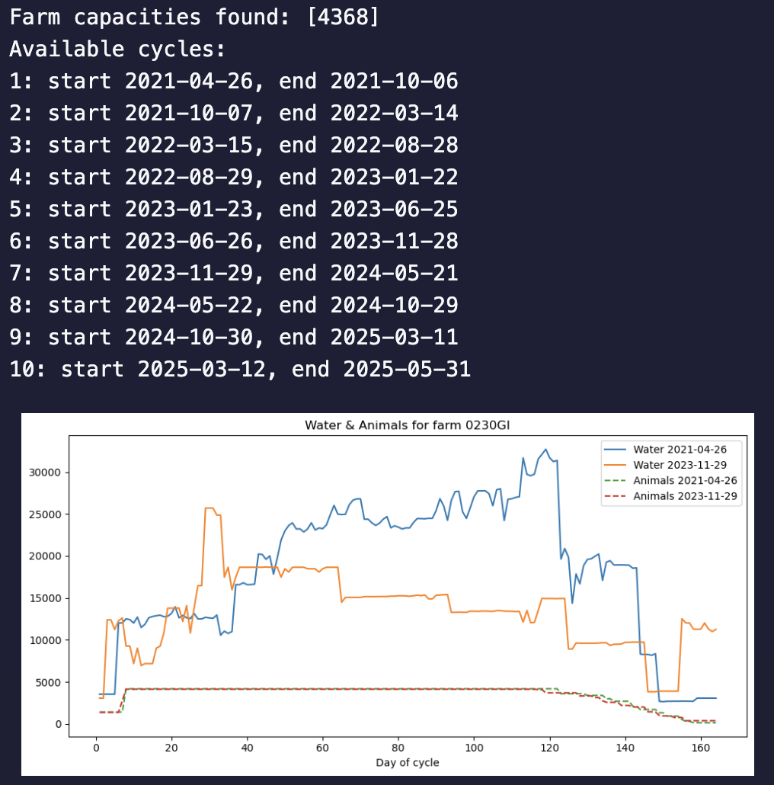

# CATALUNYA WATER CONSUMPTION MODEL

>Please open the README with a Markdown viewer

> **Warning:** Ensure that you downloaded the project with the correct folder structure. You should have a `data` folder containing the following empty folders (if you downloaded it via Github) : `base_data`,`temp_results` ,`final_results`. If you don't have those folders, please create them.

## Required Base Data for the Project

- census_all.csv
- farms with coordinates.xlsx
- Water Database.xlsx

> **Warning:** Files must be named exactly as shown; otherwise, execution errors may occur. They should also be placed inside the `CATALUNYA-CATALUNYA-WATER-CONSUMPTION MODEL/data/base_data` folder


Ensure each file follows this format and contains the following columns:

census_all.csv (delimiter is ';') :
|   | MO     | Data_censo | capacidad | id_mov_entrada | id_mov_salida | num_anim_entrada | num_anim_salida | num_anim_total | fecha_inicio_ciclo | periodo_inicio_ciclo | semana | peso_medio | total_peso | max_mov | morts | percent_mortalitat | pes_acum_morts | estimats | estat_explotacio | cicle | canvi_cicle | origens | explot_origens     | acum_origens     | explot_desti | acum_destins | num_anim_final | acum_estimats | exces_manca |
|---|--------|------------|-----------|----------------|----------------|-------------------|------------------|----------------|---------------------|------------------------|--------|-------------|-------------|---------|--------|---------------------|------------------|----------|-------------------|--------|--------------|---------|----------------------|-------------------|---------------|----------------|------------------|----------------|--------------|
| 1 | 0010AM | 2021-02-19 | 710       | 1              | 0              | 710               | 0                | 710            | 2021-02-19          | 2-2021                 | 0      | 19,2        | 13632       | 1       | 0      | 0                   | 0                | 0        | plena             | 1      | E            |         | |||Casa Cuquerlo     | |||Catalunya       |               |                | 710              | 0              | 0            |

farms with coordinates.xlsx
| MO | CODI REGA | ESTAT EXPLOTACIÓ | DATA CANVI ESTAT EXPLOTACIÓ | DATA FI EXPLOTACIÓ | NOM EXPLOTACIO | ADREÇA EXPLOTACIÓ | CODI POSTAL EXPLOTACIO | SERVEI TERRITORIAL  EXPLOTACIÓ | PROVINCIA EXPLOTACIÓ | COMARCA EXPLOTACIÓ | MUNICIPI EXPLOTACIÓ | COORDENADA X EXPLOTACIÓ | COORDENADA Y EXPLOTACIÓ | LATITUD EXPLOTACIÓ | LONGITUD EXPLOTACIÓ | TIPUS EXPLOTACIÓ | ESPÈCIE | TIPUS SUBEXPLOTACIÓ | INTEGRADORA | NOM ADS | CLASSIFICACIÓ ZOOTÈCNICA | DATA CLASSIFICACIÓ ZOOTÈCNICA |
| --- | --- | --- | --- | --- | --- | --- | --- | --- | --- | --- | --- | --- | --- | --- | --- | --- | --- | --- | --- | --- | --- | --- |
| 0010AA | ES250010030750 | Activa | 1997-01-21 00:00:00 | NaT | CASA JULIU - JORDI GASA | MASIA JULIU | 25651.0 | Alt Pirineu | Lleida | Pallars Jussà | Abella de la Conca | 340614.1 | 4667399.98 | 42.0º 8.0' 33.0498'' | 1.0º 4.0' 16.269'' | Producció i reproducció | Porcí | Producció i reproducció | ESTISANER, SL   | ADS RAMADERA PORCICAT   | Engreix | 2007-09-26 00:00:00 |

Water Database.xlsx
| Building_name | lotcode | Date | Hour | Feed_intake_kg | num_animals | water_L | NH3 | CO2 | Humidity | Outside_temperature | Inside_temperature | Indiv_Water_mL |
| --- | --- | --- | --- | --- | --- | --- | --- | --- | --- | --- | --- | --- |
| Granja 1.0.1 | 7 | 2020-12-22 00:00:00 | 0 | 7.0 | 716.0 | 25.0 | 17.0 | 0.0 | 66.5 | 6.8 | 22.45 | 34.91620111731844 |


## Installing Python and the Required Modules

> **Warning:** These commands were generated by ChatGPT and should work fine. I, Thomas PICOU, used Conda to install modules because I already had it on my machine. Please review any commands before running them.


### macOS/Linux Python Installation

Depending on your preference (Conda is recommended), you can install Python using the following commands:

Conda : 


```bash
# Download Miniconda installer
curl -O https://repo.anaconda.com/miniconda/Miniconda3-latest-MacOSX-x86_64.sh

# Run the installer
bash Miniconda3-latest-MacOSX-x86_64.sh

# Follow on-screen instructions (say yes to init)

# Restart shell or source profile
source ~/.bashrc   # or ~/.zshrc if you're using zsh

# Verify installation
conda --version

```

Pip : 

```bash
# Step 1: Install Homebrew if not already installed
/bin/bash -c "$(curl -fsSL https://raw.githubusercontent.com/Homebrew/install/HEAD/install.sh)"

# Step 2: Install Python 3
brew install python

# Step 3: Verify installation
python3 --version
pip3 --version
```

### Windows Python Installation

If you are on Windows, you can run the following commands:


```bash
# Download official Python installer (64-bit)
Invoke-WebRequest -Uri "https://www.python.org/ftp/python/3.12.2/python-3.12.2-amd64.exe" -OutFile "python-installer.exe"

# Run silent install (adds to PATH and installs pip)
Start-Process -FilePath "python-installer.exe" -ArgumentList "/quiet InstallAllUsers=1 PrependPath=1 Include_pip=1" -Wait

# Cleanup
Remove-Item "python-installer.exe"

# Refresh environment variables
$env:Path += ";C:\Program Files\Python312\Scripts;C:\Program Files\Python312\"

# Verify Python and pip
python --version
pip --version
```

### macOS/Linux Module Installation

Depending on your Python installation, you can install modules using `pip install`:

```bash
pip install pandas matplotlib seaborn numpy xarray joblib scikit-learn cdsapi pyproj
```

Or install via Conda:

```bash
conda install pandas matplotlib seaborn numpy xarray joblib scikit-learn pyproj -c conda-forge
pip install cdsapi
```

### Windows Module Installation

```bash
pip install pandas matplotlib seaborn numpy xarray joblib scikit-learn cdsapi pyproj
```

## Retrieving and Formatting the Copernicus ERA5 Temperature Dataset

### Setting Up the Credentials File

In order to retrieve the Copernicus ERA5 dataset, you first need an account at [ECMWF Login](https://accounts.ecmwf.int/…). Please complete the registration procedure and provide any required information during profile creation.

Once registered, go to the [Climate Data Store](https://cds.climate.copernicus.eu/) and navigate to:


*User Name (top right) -> Your profile  ->  API Token (scroll down a bit)*


After retrieving the API token, you need to store it in a credentials file. To do so, inside your project folder (for example):


```bash
 thomas@MacBook-Pro-de-Thomas-3 Water Consumption Model     
```

Enter this command to create the credentials file:


```bash
 nano ~/.cdsapirc     
```

Modify the file to look like this : 

```yaml
  url: https://cds.climate.copernicus.eu/api
  key: <YOUR API TOKEN> 
```

After that you should be ready to go.


### Retrieving and Formatting the Dataset

Now we can run the Python script to retrieve the complete dataset. Please open the first configuration file located at:

`CATALUNYA-WATER-CONSUMPTION-MODEL/scripts/setup/1-ERA5_imports.py`

This file sends API requests to the Climate Data Store to retrieve the required information. Because the site prevents requests that are too large, the code sends one request per year in the range you defined for the Catalonia region.


```python 
area = [42.0, -1.0, 38.0, 5.0] # Spatial location of Catalonia
```

Before executing the file, please modify the following time range to match your needs:

```python
start_year = 2021
end_year = 2025
end_month = 5
```

This loop queries each month: for all years earlier than the last year, it retrieves all months; otherwise, it retrieves only up to the specified month. Feel free to modify the code if you need to specify a particular date.


```python
for year in years:
    if year < end_year:
        months = [f"{m:02d}" for m in range(1, 13)]
    else:
        months = [f"{m:02d}" for m in range(1, end_month+1)]   
````


Here is the API request that the code sends:

```python
c.retrieve(
        'derived-era5-land-daily-statistics',
        {
            'variable':        ['2m_temperature'],      # Mean 2 m temperature
            'daily_statistic': 'daily_mean',            # Compute daily mean
            'time_zone':       'utc+00:00',             # Boundaries in UTC
            'frequency':       '6_hourly',              # 6-hourly data for stats
            'area':            area,
            'year':            [str(year)],
            'month':           months,
            'day':             days,
            'format':          'netcdf',
        },
        target_file
    )
```

The request retrieves the daily average temperature, calculated from data at 6‑hour intervals, for the specified location.

After setting all those parameters, you can execute the script. If everything goes well, you should see the following output:


```
thomas@MacBook-Pro-de-Thomas-3 CATALUNYA-WATER-CONSUMPTION-MODEL % /opt/anaconda3/bin/python "/Users/thomas/VS Code/CATALUNYA-WATER-CONSUMPTION-MODEL/scripts/setup/1-ERA5_imports.py"
2025-07-28 14:44:33,449 INFO [2024-09-26T00:00:00] Watch our [Forum](https://forum.ecmwf.int/) for Announcements, news and other discussed topics.
Requesting 2021, saving to /Users/thomas/VS Code/CATALUNYA-WATER-CONSUMPTION-MODEL/data/base_data/era_downloads/era5land_cat_2021.nc...
2025-07-28 14:44:34,904 INFO Request ID is 455c9746-4802-4782-b5e8-9b184c4a1726
2025-07-28 14:44:34,982 INFO status has been updated to accepted
2025-07-28 14:45:25,220 INFO status has been updated to successful
Requesting 2022, saving to /Users/thomas/VS Code/CATALUNYA-WATER-CONSUMPTION-MODEL/data/base_data/era_downloads/era5land_cat_2022.nc...
2025-07-28 14:45:30,185 INFO Request ID is 8b51bd11-3415-4540-81b9-777aec41b842
2025-07-28 14:45:30,288 INFO status has been updated to accepted
2025-07-28 14:46:20,433 INFO status has been updated to successful
Requesting 2023, saving to /Users/thomas/VS Code/CATALUNYA-WATER-CONSUMPTION-MODEL/data/base_data/era_downloads/era5land_cat_2023.nc...
2025-07-28 14:46:21,395 INFO Request ID is 3e7b44b7-5487-4b0c-9f69-19f5754e00d0
2025-07-28 14:46:21,562 INFO status has been updated to accepted
2025-07-28 14:47:11,693 INFO status has been updated to successful
Requesting 2024, saving to /Users/thomas/VS Code/CATALUNYA-WATER-CONSUMPTION-MODEL/data/base_data/era_downloads/era5land_cat_2024.nc...
2025-07-28 14:47:15,745 INFO Request ID is 22b97afd-06e3-4aaf-9307-147b6dd94e11
2025-07-28 14:47:15,812 INFO status has been updated to accepted
2025-07-28 14:48:31,590 INFO status has been updated to successful
Requesting 2025, saving to /Users/thomas/VS Code/CATALUNYA-WATER-CONSUMPTION-MODEL/data/base_data/era_downloads/era5land_cat_2025.nc...
2025-07-28 14:48:35,590 INFO Request ID is 1c0cb02e-9dc9-44c6-8748-7990c27b9dfc
2025-07-28 14:48:35,672 INFO status has been updated to accepted
2025-07-28 14:48:57,070 INFO status has been updated to successful
Merging yearly files into a single dataset...                                                                       
Dataset dimensions: Frozen({'valid_time': 1612, 'latitude': 41, 'longitude': 61})
Using 'valid_time' as time dimension for resampling
Merged dataset saved to /Users/thomas/VS Code/CATALUNYA-WATER-CONSUMPTION-MODEL/data/base_data/era_downloads/era5land_cat_2021-2025_01-05_daily.nc
```

Double check that everything has gone well by verifying that all files are present. Navigate to:

`CATALUNYA-WATER-CONSUMPTION-MODEL/data/base_data/era_downloads`

You should see the downloaded files for each year and the merged file that was exported.


### Extracting Temperature Data for the Farms

We will now use the script `2-Create_temp_dataset.py`, located at:

`CATALUNYA-WATER-CONSUMPTION-MODEL/scripts/setup/2-Create_temp_dataset.py`

This script reads the `farms_with_coordinates.xlsx` file to extract each farm’s coordinates and the associated farm ID (MO), then queries the temperature dataset accordingly. The time range is not specified in this script. For each farm it will retrieve all available datapoints (retrieved in the defined time range in the previous step).

```python
merged_nc = os.path.join(data_dir, 'era5land_cat_2021-2025-05_daily.nc')
```

After execution, for each farm ID, the script queries the daily temperature over the specified interval and outputs a temporary result at:

`CATALUNYA-WATER-CONSUMPTION-MODEL/data/temp_results/farms_daily_t2m_2021-2025.csv`

If everything goes well, you should see quick terminal output indicating which farm is being processed, the associated coordinates, the nearest grid point in the temperature dataset, and any missing temperature data:


```
...
Processing farm 9420AT: target lon=0.5532, lat=41.6865…
  Nearest grid point -> lon=0.6000, lat=41.7000
  Days total=1612, missing=0
Processing farm 9420BA: target lon=0.5733, lat=41.6603…
  Nearest grid point -> lon=0.6000, lat=41.7000
  Days total=1612, missing=0
Processing farm 9420BC: target lon=0.5479, lat=41.6820…
  Nearest grid point -> lon=0.5000, lat=41.7000
  Days total=1612, missing=0
Processing farm 9450BT: target lon=0.7003, lat=40.8289…
  Nearest grid point -> lon=0.7000, lat=40.8000
  Days total=1612, missing=0
Processing farm 9450CV: target lon=0.6950, lat=40.8246…
  Nearest grid point -> lon=0.7000, lat=40.8000
  Days total=1612, missing=0
Writing CSV with 9312524 records to /Users/thomas/VS Code/CATALUNYA-WATER-CONSUMPTION-MODEL/data/temp_results/farms_daily_t2m_2021-2025.csv
All done.
```

You can verify that everything has completed successfully by running the debug script located at:

`CATALUNYA-WATER-CONSUMPTION-MODEL/scripts/debug/DEBUG_check_NaN_temp_result_db_copy.py`

If everything ran as intended, it should output the following:


```
thomas@MacBook-Pro-de-Thomas-3 Water Consumption Model % /opt/anaconda3/bin/python "/Users/thomas/VS Code/CATALUNYA WATER CONSUMPTION MODEL/scripts/debug/DEBUG_check_NaN_temp_result_db copy.py"
No NaN values found in 't2m_C'
```

### Merging Results into the Census File

We will now look at the final setup script located at:

`CATALUNYA-WATER-CONSUMPTION-MODEL/scripts/setup/3-Merging_Census_to_temperature.py`

This script merges the results we extracted with the base census file. It then exports a temporary result at:

`CATALUNYA-WATER-CONSUMPTION-MODEL/data/temp_results/census_all_t2m.csv`

If everything has gone well, you should see output like:


```
...
Farm 9420AB: missing t2m_C values = 0
  Farm 9420AG: missing t2m_C values = 0
  Farm 9420AH: missing t2m_C values = 0
  Farm 9420AI: missing t2m_C values = 0
  Farm 9420AL: missing t2m_C values = 0
  Farm 9420AM: missing t2m_C values = 0
  Farm 9420AN: missing t2m_C values = 0
  Farm 9420AO: missing t2m_C values = 0
  Farm 9420AT: missing t2m_C values = 0
  Farm 9420BA: missing t2m_C values = 0
  Farm 9420BC: missing t2m_C values = 0
Writing merged dataset to /Users/thomas/VS Code/CATALUNYA-WATER-CONSUMPTION-MODEL/data/temp_results/census_all_t2m.csv
Done.
```

Now that this is done, we are ready to train the model with our new dataset.

## Training and Exporting the KNN Model

> **Warning:** For confidential reasons, the model might not be present if you downloaded the project via Github. In this case, please follow the step to recreate / retrain the model in order for the code to work.

Because the model is trained on “fixed” data, its precision should not change even after you query more ERA5 data. The pre-trained model should be present at:

`CATALUNYA-WATER-CONSUMPTION-MODEL/data/models/knn_water_model.joblib`

- You don’t have access to the pre-trained model  
- You have new data concerning the farm used to train the model (0230GI)  
- You want to retrain the model
- You downloaded the project via Github

### Filtering the Census File

In the previous step, we created a census file that contains data for all farms from 2021 to May 2025. We don’t need data for every farm to train our model, nor do we need data outside Maria’s Water Database time period. To do this, run the script located at:

`CATALUNYA-WATER-CONSUMPTION-MODEL/scripts/setup/MODEL-Isolate_Maria_data.py`

This script creates a subset of the census file that we will use to train our model.

If you have new data for Maria’s farm (0230GI), you need to modify the time range defining the subset. You can do this by changing the following parameter in the code:


```python
# In[5]: Subset to the desired date range
subset = data[
    (data["Insertion date"] >= "2021-04-26") &
    (data["Insertion date"] <= "2025-07-01")
].copy()
```

After execution, if everything has gone well, you should see the following output:

```
thomas@MacBook-Pro-de-Thomas-3 Water Consumption Model % /opt/anaconda3/bin/python "/Users/thomas/VS Code/CATALUNYA-WATER-CONSUMPTION-MODEL/scripts/setu
p/MODEL-Isolate_Maria_data.py"
Written 1497 rows for farm 0230GI to /Users/thomas/VS Code/CATALUNYA-WATER-CONSUMPTION-MODEL/data/temp_results/filtered_census_t2m.csv
```

### Training the KNN Model

If needed, you can now retrain the model. To visualize it, it’s best to use Jupyter.

Open the KNN model script located at:

`CATALUNYA-WATER-CONSUMPTION-MODEL/scripts/model/KNN-model.py`

#### Installing Jupyter

If you don’t have Jupyter installed, install it with the following command:


```bash
pip install jupyterlab ipykernel
```
You should now see a **Run Cell** button next to each `# In[...]` cells.

You can start the training process in Jupyter by either clicking the **Run Below** button on the first cell (line 1) or selecting **Run Current Cell in Interactive Window** from the Run menu:


You should see an interactive window appear, like this:


Please make sure that the results are the ones you expect. At the bottom of the interactive window, you should see the following plots and results showcasing the model after training:


>In this version, 95 % of the data is used for training, leaving 5 % for evaluation (which gave the best overall accuracy).
You can change this by modifying the `test_size` parameter here :

```python
X_train, X_test, y_train, y_test = train_test_split(X, y, test_size = 0.05, random_state = 1)
```


If you want to take a closer look at how the model behaves and how it should behave, you can check the saved Jupyter Notebook that relates to the pre‑trained model (complete expected output) located at:

`CATALUNYA-WATER-CONSUMPTION-MODEL/notebooks/KNN-model.ipynb`

> **Warning:** For confidential reasons, notebooks might not be present in the project if you downloaded it via Github

Please note that if everything executed as intended, you should now see the model appear at:

`CATALUNYA-WATER-CONSUMPTION-MODEL/data/models/knn_water_model.joblib`

If that’s the case, your model has been exported and is ready to be used by the main script to predict water consumption for the census dataset.

NB: Because we used the following variables to train our model:

- total_weight  
- num_anim_total  
- t2m_C  
- month_sin  
- month_cos  

Those variables are all available for every farm; the only farm‑specific data was Maria’s water consumption (the target). The model should not be significantly biased.

## Predicting on the Whole Dataset

Now that we have our pre‑trained model (or have retrained it), we can use it to predict water consumption for the entire census dataset.

To do so, open the main script located at:

`CATALUNYA-WATER-CONSUMPTION-MODEL/scripts/main/main.py`

When you run it, the script loads the census file (which includes temperature) and predicts water consumption for each farm, for each day in the dataset.

To ensure reliability and avoid crashes, the code checks that no temperature data is missing. If any is missing, that farm is skipped and no erroneous data is output. A CSV file listing all skipped farms will be generated.

If everything has executed as intended, you should see output like this:

```
thomas@MacBook-Pro-de-Thomas-3 Water Consumption Model % /opt/anaconda3/bin/python "/Users/thomas/VS Code/CATALUNYA-WATER-CONSUMPTION-MODEL/scripts/main
/main.py"
row                           int64
MO                           object
Insertion date               object
capacity                      int64
in                            int64
out                           int64
in_animals                    int64
out_animals                   int64
num_anim_total                int64
fatting-start                object
month-year-fatting-start     object
week                          int64
avg_weight                   object
total_weight                float64
max_mov                       int64
deaths                        int64
death-percentage             object
pes_acum_morts                int64
estimations                  object
farm_status                  object
cycle_id                      int64
cycle-change                 object
origins                     float64
farm_origins                 object
full_origins                 object
destination                  object
full_destination             object
nb_anim_final                 int64
acum_estimats                object
exces_manca                   int64
t2m_C                       float64
dtype: object
Processing 1/2999 – Farm ID: 0010AM
Processing 2/2999 – Farm ID: 0010AO
Processing 3/2999 – Farm ID: 0010AT
Processing 4/2999 – Farm ID: 0030CG
Processing 5/2999 – Farm ID: 0030CK
Processing 6/2999 – Farm ID: 0030CY
...
Processing 2996/2999 – Farm ID: 4930BD
Processing 2997/2999 – Farm ID: 6800AG
Processing 2998/2999 – Farm ID: 8000AD
Processing 2999/2999 – Farm ID: 8920AR
```

It took 25 minutes to process the data for all farms from 01/01/2021 to 31/05/2025. So we can approximate that it took 0,5s for a single farm to be processed.

You shouldn't have any missing data if you didn't see any message saying so but we can double check using the debug script located at:

`CATALUNYA-WATER-CONSUMPTION-MODEL/scripts/debug/DEBUG_check_NaN_final_result_db.py`


If you have no missing data you should have this output : 

```
thomas@MacBook-Pro-de-Thomas-3 Water Consumption Model % /opt/anaconda3/bin/python "/Users/thomas/VS Code/CATALUNYA-WATER-CONSUMPTION-MODEL/scripts/debu
g/DEBUG_check_NaN_final_result_db.py"
No NaN values found in 't2m_C' or 'Total water consumption'.
```

## Analyzing Our Results

Now that we've predicted total water consumption for all available farms, we can analyze the results. To do this, run the analytics script located at:

`CATALUNYA-WATER-CONSUMPTION-MODEL/scripts/analytics/analytics.py`

To better visualize the results, run it in a Jupyter interactive window, which allows multiple plots to appear on screen simultaneously. At each loop iteration, you’re presented with five options, the fifth of which properly exits the loop.

### Plotting Predicted Data for a Farm

When you enter **1**, you’ll be prompted for the farm ID (MO) you wish to plot. After that, you’ll see plots of:

- Predicted water consumption  
- Evolution of total weight  
- Evolution of number of animals  

You’ll also see the total water consumed during this period (in liters) displayed below the plot.

Example output for farm **0230GI**:


### Visualizing Water Consumption Geographically

When you enter **2**, you’ll see a plot showing each farm group separately:

- **C1:** ≤ 500 animals  
- **C2:** 500–1,000 animals  
- **C3:** 1,000–2,000 animals  
- **C4:** 2,000–3,000 animals  
- **C5:** > 3,000 animals

Example output:


### Comparing Water Consumption over Different Fattening Cycles

When you enter **3**, you’ll be prompted for the farm ID (MO) to analyze. The script will then print the farm’s total capacity and list all dates found (start and end) for each fattening cycle. You’ll select two cycles, and the script will plot different charts showing the evolution of various variables—such as total water consumption, total number of animals, total weight, and temperature—over those cycles.

Example output:





### Calculating Total Water Consumption in Catalonia

When you enter **4**, you’ll be prompted to enter two dates in `YYYY-MM-DD` format. These dates define the time range for computing the average and total water consumption. If a date falls outside the dataset’s range, it will automatically reset to the earliest or latest available date. You may enter them in any order—it won’t affect the result.


Example output:

```
============== Total ==============

C1 <500 animals: 6.31e+09
C2 500-1000 animals: 8.73e+09
C3 1000-2000 animals: 9.85e+09
C4 2000-3000 animals: 2.23e+09
C5 >3000 animals: 1.58e+09
Total: 2.87e+10 L

============== Average (per day) ==============

C1 <500 animals: 11946.954222451357
C2 500-1000 animals: 17077.523945142675
C3 1000-2000 animals: 17891.347148716883
C4 2000-3000 animals: 18170.01714027458
C5 >3000 animals: 18494.74791306
Total: 16716.118073929098 L per day
```

## Test branch

Here are the instruction to reproduce the tests that use the synthethic data. In order to do so you will need to use the synthetic data available at `data/base_data/synthetic_data.csv'. 

> **Warning:** It might not be available depending on the sensitive level that this synthetic data had been given. If this is the case you can't reproduce the test or need to recreate synthethic data by yourself.

Because only synthethic data as been made available you will need to recreate the full training dataset to train the model.

### Recreating synthetic dataset

In order to do so please execute the following setup file located at `CATALUNYA-WATER-CONSUMPTION-MODEL/scripts/setup/MODEL-export-0230GI-data`. This file will run the beginning of the model training just to output the corresponding data of the reference farm (0230GI) to use the maximum amount of real data that we have.

If everything goes well you should see the following output :

```bash
Building_name           0.000000
lotcode                 0.000000
Date                    0.000000
Hour                    0.000000
Feed_intake_kg         49.374451
num_animals            29.938543
...
max     11.000000            2023-01-09 00:00:00  341070.000000  ...  158614.500000            32.790556             inf
std      1.380708                            NaN   16397.023220  ...   29825.664699             8.116988             NaN

[8 rows x 7 columns]
```

Now that you have exported our real data, we can append the synthetic data to the data we've just exported. To do that please use the following file : `CATALUNYA-WATER-CONSUMPTION-MODEL/scripts/setup/MODEL-create-synthetic-dataset.py`. It will output a file named `merged_cleaned.csv` in the `base_data`folder that the `TEST` files will use as training dataset.
 
Run the file, if everything goes well you should see something like that : 

```bash
Saved 1324 rows with common columns to: /Users/thomas/VS Code/Catalunya-Water-Consumption-Model/data/base_data/merged_cleaned.csv
```

Double check that the `merged_cleaned.csv` as been outputed. 

### Retraining model

You can now retrain the model but this time using the `CATALUNYA-WATER-CONSUMPTION-MODEL/scripts/model/TEST-KNN-model.py` file.

### Predicting new results

To predict new results you can use the TEST-main file : `CATALUNYA-WATER-CONSUMPTION-MODEL/scripts/main/TEST-main.py`. This file is set to only run for a couple farm instead of the 3000 availables : 

```python
farm_ids = ["0230GI", "0030CY", "0040EB", "0040KK"]
```

### Perform analysis

To perform analysis on those file you can run the TEST analysis file located at : `CATALUNYA-WATER-CONSUMPTION-MODEL/scripts/analytics/TEST-analytics.py`